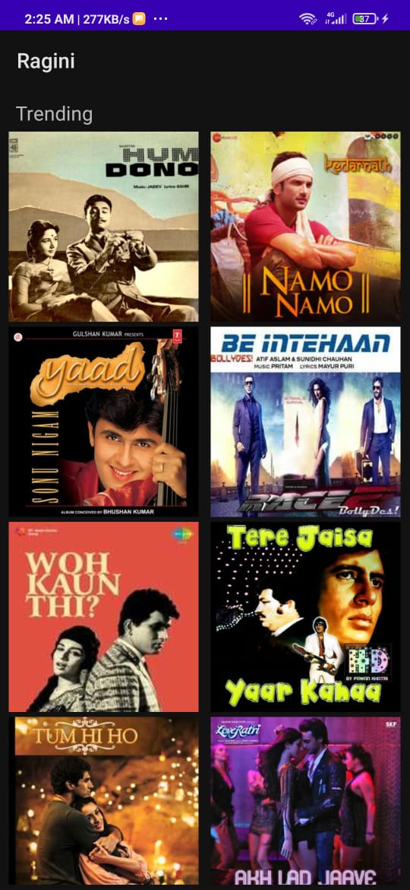
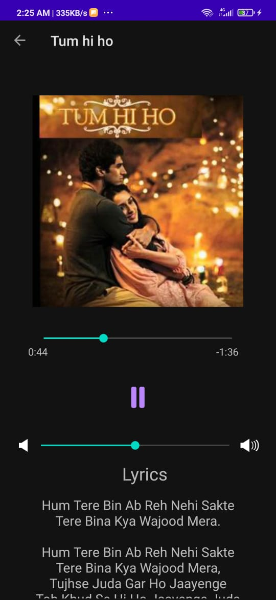
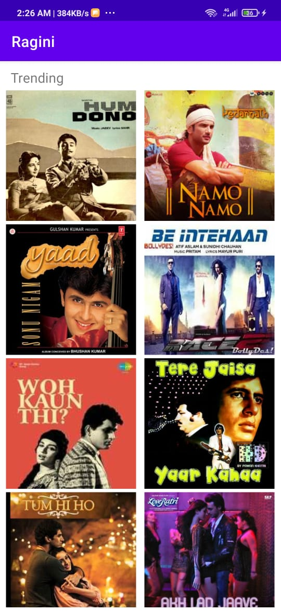
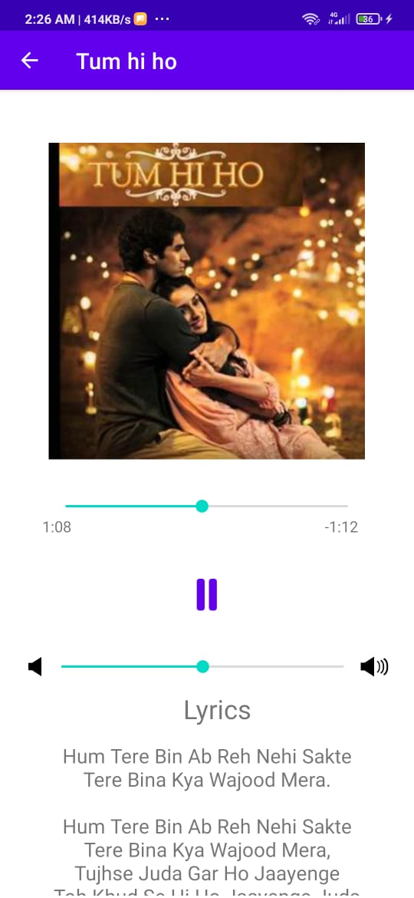

# Kotlin_Music_Player
A music player app created in Kotlin.

The app contain 10 songs with lyrics as a demo, you can select any song and it will start playing, on completion of a song, the next song will start to play automatically and the songs will stop in the end of the playlist.

To use the app, simply fork and clone this repo and open the project in Android Studio to start. Any pull request or issue is highly appreciated. To only use the app, you can also just download the app_debug.apk file and install it in your Android device.

Feel free to leave a star if this Player helped you in any way.

## Screenshots

     

     

     

     

